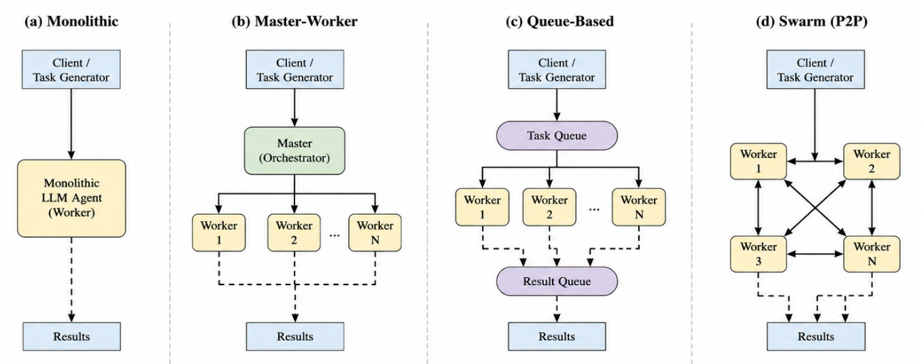
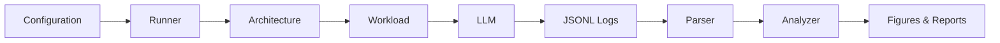

# Distributed Agent Simulation

A simulation framework for evaluating LLM-based multi-agent orchestration architectures from a distributed systems perspective.

Instead of comparing reasoning quality, this project investigates how different orchestration strategies behave under identical workloads. The framework focuses on scalability, coordination overhead, bottlenecks, latency, and failure propagation while keeping the workload and execution environment consistent.

The project was developed for a distributed systems study comparing multiple orchestration architectures using reproducible experiments and structured execution logging.

---

## Features

- Compare four multi-agent orchestration architectures
- Evaluate both parallel and sequential workloads
- Config-driven experiment execution
- Structured JSONL event logging
- Automatic metric extraction and analysis
- Failure injection for crash and straggler experiments
- Reproducible experiments with metadata and Git commit tracking

---

## System Overview

The framework separates an experiment into four independent components.

```text
Configuration
        │
        ▼
Architecture
        │
        ▼
Workload
        │
        ▼
Analysis
```

This separation makes it possible to evaluate different orchestration strategies without changing workload logic or analysis code.

### Supported Architectures

| Architecture | Description |
|--------------|-------------|
| **Monolithic** | Sequential single-worker baseline |
| **Master–Worker** | Central coordinator distributes work to multiple workers |
| **Queue-Based** | Producer–consumer model using task and result queues |
| **Swarm** | Decentralized task handoff through predefined routing |



### Workloads

Two workloads are included to represent different execution characteristics.

| Workload | Characteristics | Primary Purpose |
|----------|-----------------|-----------------|
| **Task A** | Highly parallel document summarization | Scalability and throughput |
| **Task B** | Sequential multi-hop question answering | Coordination and dependency overhead |

### Evaluation Metrics

Experiments collect structured execution logs and derive metrics including:

- Throughput
- P50 / P99 latency
- Queue wait time
- Worker utilization
- Wall-clock execution time
- Failure statistics

---

## Experiment Pipeline

Every experiment follows the same execution flow.



The framework stores structured event logs instead of only aggregated metrics. As a result, experiments can be analyzed repeatedly without rerunning expensive LLM inference.

---

## Quick Start

### 1. Install dependencies

```bash
pip install -r requirements.txt
```

### 2. Configure environment variables

Copy the example environment file.

```bash
cp .env.example .env
```

At minimum, configure:

```text
GEMINI_API_KEY=YOUR_API_KEY
```

Multiple API keys are also supported.

```text
GEMINI_API_KEY1=...
GEMINI_API_KEY2=...
...
```

The client automatically performs API key rotation and exponential backoff when rate limits occur.

### 3. Configure an experiment

Edit one of the YAML configuration files under `configs/`.

Typical parameters include:

- architecture
- workload
- worker count
- failure mode
- logging options

### 4. Run an experiment

```bash
python runner/run_experiment.py \
    --config configs/example.yaml
```

### 5. Parse experiment logs

```bash
python parser/metrics_parser.py
```

### 6. Analyze results

Use the analysis scripts under `analyzer/` to generate figures and summary statistics from the parsed metrics.

---

## Repository Structure

```text
distributed-agent-simulation/
├── architectures/      # Multi-agent orchestration implementations
├── core/               # Shared runtime components
├── workloads/          # Experimental workloads
├── runner/             # Experiment entry points
├── parser/             # Log parsing and metric extraction
├── analyzer/           # Result analysis and visualization
├── configs/            # YAML experiment configurations
├── mock_llm/           # Mock inference server
├── data/               # Input datasets
├── reports/            # Generated reports and figures
└── result4/            # Experiment outputs
```

| Directory | Purpose |
|-----------|---------|
| `architectures/` | Implementations of the four orchestration strategies |
| `core/` | Configuration, logging, LLM client, and shared utilities |
| `workloads/` | Task definitions executed by every architecture |
| `runner/` | Scripts for running experiments |
| `parser/` | Converts JSONL logs into structured metrics |
| `analyzer/` | Generates figures and higher-level analyses |
| `configs/` | Experiment configuration files |
| `reports/` | Report generation scripts and figures |
| `result4/` | Default output directory for experiment results |

---

## Architecture Comparison

Each architecture executes the same workload but differs in how work is coordinated.

| Architecture | Coordination | Parallel | Primary Focus |
|--------------|-------------|----------|---------------|
| **Monolithic** | Single worker | No | Baseline |
| **Master–Worker** | Central coordinator | Yes | Coordination overhead |
| **Queue-Based** | Producer–consumer queues | Yes | Queue behavior |
| **Swarm** | Decentralized handoff | Yes | Peer-to-peer coordination |

### Monolithic

A sequential baseline without coordination overhead.

- Simple execution model
- No parallelism
- Used as the reference architecture

### Master–Worker

A centralized coordinator distributes work to multiple workers.

- Efficient for parallel workloads
- Aggregation performed by the master
- Coordinator may become a bottleneck

### Queue-Based

Tasks are exchanged through producer–consumer queues.

- Asynchronous execution
- Loose coupling between workers
- Additional queue management overhead

### Swarm

Workers exchange tasks directly using predefined routing rules.

- No centralized coordinator
- Peer-to-peer task handoff
- Static routing strategy

---

## Example Experiment Workflow

A typical experiment consists of only a few steps.

```text
Edit Configuration
        │
        ▼
Run Experiment
        │
        ▼
Generate JSONL Logs
        │
        ▼
Parse Metrics
        │
        ▼
Analyze Results
        │
        ▼
Generate Figures
```

Because logs are stored separately from analysis results, additional metrics can be generated later without rerunning the experiment.

---

## Experimental Results

The accompanying report evaluates the framework using four orchestration architectures under identical workloads and execution conditions.

The experiments investigate:

- Scalability as worker count increases
- Throughput under different workloads
- Tail latency (P50 / P99)
- Queue waiting time
- Failure propagation
- Worker utilization

### Key Findings

- Increasing the number of workers does **not** guarantee linear throughput improvement.
- Workload characteristics often have a greater impact on performance than the orchestration architecture itself.
- Lower average latency does not necessarily imply lower tail latency.
- System bottlenecks shift as concurrency increases.
- Failure propagation depends on the coordination strategy.

---

## Limitations

This project is intended as an experimental framework rather than a production-ready distributed system.

Current limitations include:

- Single-machine simulation environment
- Simplified queue implementation
- Static routing in the Swarm architecture
- No checkpointing or automatic task recovery
- Network latency and distributed communication are not explicitly modeled