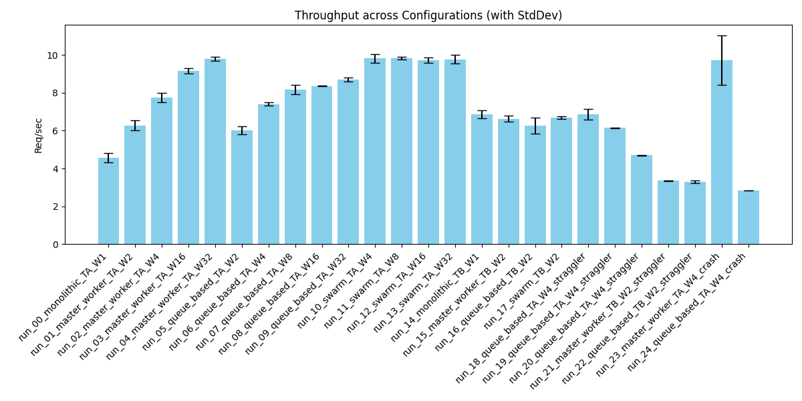
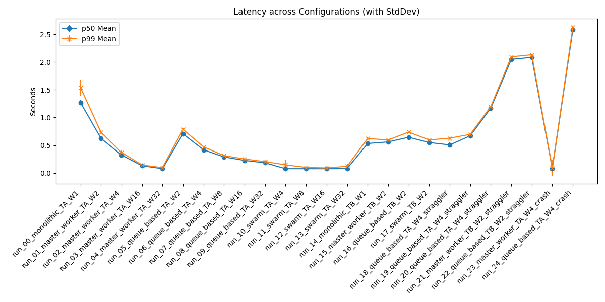
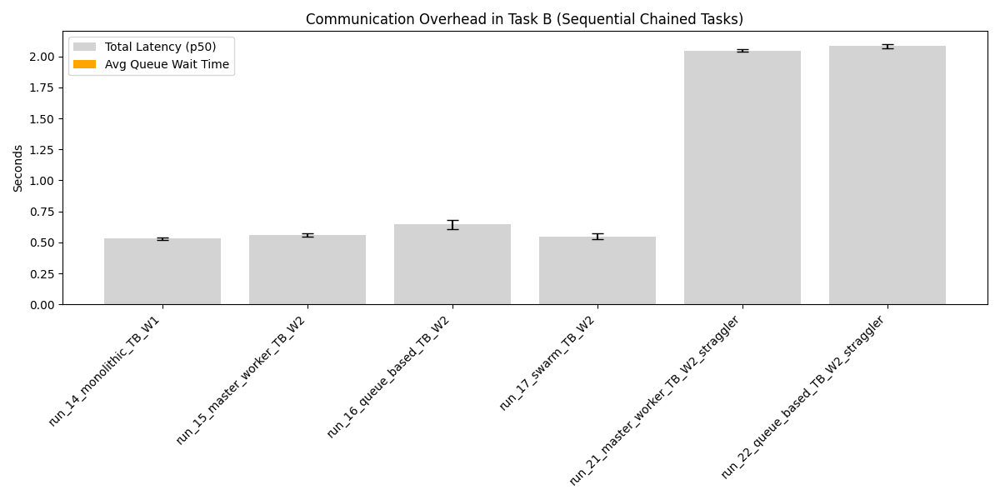

# Distributed Agent Simulation Summary Report

## 1. Overview
Generated from batch: `batch_20260603_122438`

## 2. Aggregate Metrics Data
| run_name                             |   throughput_req_per_sec_mean |   throughput_req_per_sec_std |   p50_latency_sec_mean |   p50_latency_sec_std |   p99_latency_sec_mean |   p99_latency_sec_std |   avg_queue_wait_sec_mean |   avg_queue_wait_sec_std |
|:-------------------------------------|------------------------------:|-----------------------------:|-----------------------:|----------------------:|-----------------------:|----------------------:|--------------------------:|-------------------------:|
| run_00_monolithic_TA_W1              |                         4.57  |                        0.243 |                  1.27  |                 0.05  |                  1.541 |                 0.147 |                     0     |                    0     |
| run_01_master_worker_TA_W2           |                         6.272 |                        0.263 |                  0.624 |                 0.023 |                  0.733 |                 0.038 |                     0.269 |                    0.002 |
| run_02_master_worker_TA_W4           |                         7.739 |                        0.242 |                  0.326 |                 0.014 |                  0.372 |                 0.044 |                     0.122 |                    0.005 |
| run_03_master_worker_TA_W16          |                         9.155 |                        0.134 |                  0.13  |                 0.005 |                  0.144 |                 0.007 |                     0.01  |                    0     |
| run_04_master_worker_TA_W32          |                         9.797 |                        0.097 |                  0.078 |                 0     |                  0.097 |                 0.007 |                     0.001 |                    0     |
| run_05_queue_based_TA_W2             |                         6.024 |                        0.215 |                  0.704 |                 0.02  |                  0.785 |                 0.021 |                     0.262 |                    0.004 |
| run_06_queue_based_TA_W4             |                         7.394 |                        0.089 |                  0.418 |                 0.002 |                  0.471 |                 0.015 |                     0.119 |                    0.001 |
| run_07_queue_based_TA_W8             |                         8.172 |                        0.25  |                  0.29  |                 0.006 |                  0.313 |                 0.01  |                     0.046 |                    0.002 |
| run_08_queue_based_TA_W16            |                         8.357 |                        0.026 |                  0.226 |                 0.002 |                  0.252 |                 0.008 |                     0.01  |                    0     |
| run_09_queue_based_TA_W32            |                         8.712 |                        0.106 |                  0.183 |                 0.003 |                  0.205 |                 0.01  |                     0     |                    0     |
| run_10_swarm_TA_W4                   |                         9.817 |                        0.225 |                  0.078 |                 0     |                  0.147 |                 0.09  |                     0     |                    0     |
| run_11_swarm_TA_W8                   |                         9.842 |                        0.068 |                  0.077 |                 0     |                  0.1   |                 0.011 |                     0     |                    0     |
| run_12_swarm_TA_W16                  |                         9.726 |                        0.152 |                  0.077 |                 0     |                  0.092 |                 0.012 |                     0     |                    0     |
| run_13_swarm_TA_W32                  |                         9.775 |                        0.24  |                  0.08  |                 0.003 |                  0.121 |                 0.046 |                     0     |                    0     |
| run_14_monolithic_TB_W1              |                         6.865 |                        0.211 |                  0.532 |                 0.011 |                  0.621 |                 0.016 |                     0     |                    0     |
| run_15_master_worker_TB_W2           |                         6.621 |                        0.161 |                  0.56  |                 0.014 |                  0.596 |                 0.006 |                     0     |                    0     |
| run_16_queue_based_TB_W2             |                         6.274 |                        0.42  |                  0.644 |                 0.035 |                  0.737 |                 0.027 |                     0     |                    0     |
| run_17_swarm_TB_W2                   |                         6.678 |                        0.06  |                  0.549 |                 0.024 |                  0.596 |                 0.022 |                     0     |                    0     |
| run_18_queue_based_TA_W4_straggler   |                         6.858 |                        0.288 |                  0.506 |                 0.049 |                  0.627 |                 0.022 |                     0.141 |                    0.002 |
| run_19_queue_based_TA_W4_straggler   |                         6.142 |                        0.026 |                  0.67  |                 0.002 |                  0.697 |                 0.012 |                     0.147 |                    0.003 |
| run_20_queue_based_TA_W4_straggler   |                         4.7   |                        0.014 |                  1.169 |                 0.002 |                  1.195 |                 0.011 |                     0.146 |                    0.007 |
| run_21_master_worker_TB_W2_straggler |                         3.355 |                        0.021 |                  2.048 |                 0.012 |                  2.094 |                 0.02  |                     0     |                    0     |
| run_22_queue_based_TB_W2_straggler   |                         3.302 |                        0.064 |                  2.083 |                 0.016 |                  2.131 |                 0.014 |                     0     |                    0     |
| run_23_master_worker_TA_W4_crash     |                         9.73  |                        1.302 |                  0.081 |                 0.14  |                  0.087 |                 0.148 |                     0.027 |                    0.048 |
| run_24_queue_based_TA_W4_crash       |                         2.823 |                        0.003 |                  2.58  |                 0.031 |                  2.624 |                 0.02  |                     0.256 |                    0.004 |

## 3. Charts
### Throughput

### Latency

### Communication Overhead (Task B)

