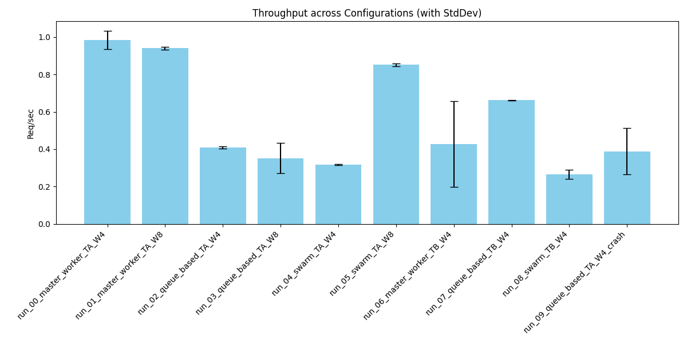
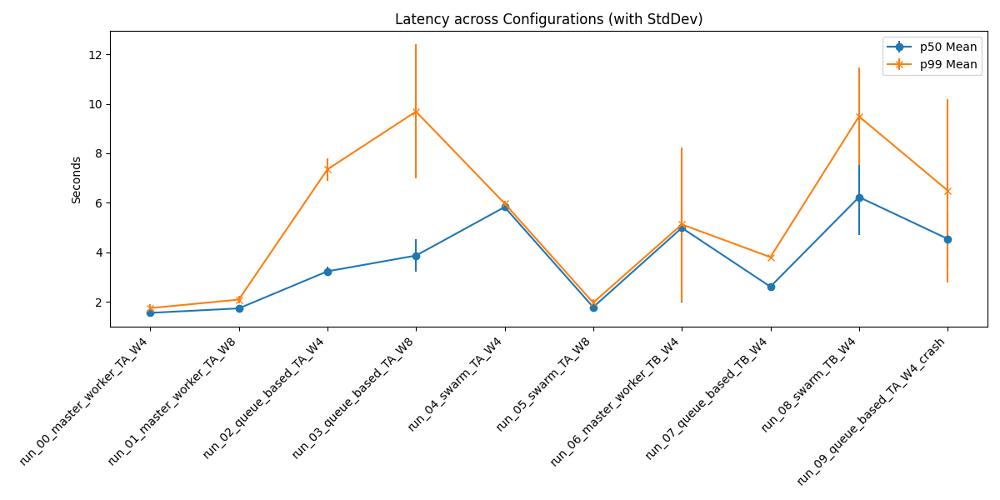
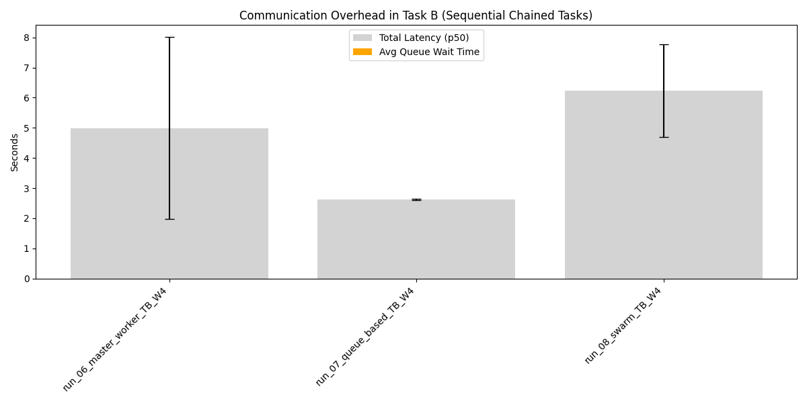

# Distributed Agent Simulation Summary Report

## 1. Overview
Generated from batch: `real_batch_20260603_210216`

## 2. Aggregate Metrics Data
| run_name                       |   throughput_req_per_sec_mean |   throughput_req_per_sec_std |   p50_latency_sec_mean |   p50_latency_sec_std |   p99_latency_sec_mean |   p99_latency_sec_std |   avg_queue_wait_sec_mean |   avg_queue_wait_sec_std |
|:-------------------------------|------------------------------:|-----------------------------:|-----------------------:|----------------------:|-----------------------:|----------------------:|--------------------------:|-------------------------:|
| run_00_master_worker_TA_W4     |                         0.983 |                        0.049 |                  1.559 |                 0.005 |                  1.751 |                 0.155 |                     0.001 |                    0     |
| run_01_master_worker_TA_W8     |                         0.94  |                        0.007 |                  1.74  |                 0.052 |                  2.095 |                 0.146 |                     0     |                    0     |
| run_02_queue_based_TA_W4       |                         0.409 |                        0.007 |                  3.236 |                 0.179 |                  7.35  |                 0.462 |                     0.225 |                    0.001 |
| run_03_queue_based_TA_W8       |                         0.351 |                        0.081 |                  3.872 |                 0.655 |                  9.686 |                 2.705 |                     0.416 |                    0.269 |
| run_04_swarm_TA_W4             |                         0.316 |                        0.002 |                  5.83  |                 0.036 |                  5.977 |                 0.11  |                     0     |                    0     |
| run_05_swarm_TA_W8             |                         0.851 |                        0.009 |                  1.79  |                 0.071 |                  1.971 |                 0.129 |                     0     |                    0     |
| run_06_master_worker_TB_W4     |                         0.427 |                        0.23  |                  4.99  |                 3.019 |                  5.13  |                 3.104 |                     0.003 |                    0.003 |
| run_07_queue_based_TB_W4       |                         0.661 |                        0.001 |                  2.616 |                 0.027 |                  3.809 |                 0.062 |                     0     |                    0     |
| run_08_swarm_TB_W4             |                         0.264 |                        0.025 |                  6.232 |                 1.531 |                  9.489 |                 1.964 |                     0     |                    0     |
| run_09_queue_based_TA_W4_crash |                         0.389 |                        0.124 |                  4.548 |                 1.147 |                  6.499 |                 3.7   |                     0.746 |                    0.252 |

## 3. Charts
### Throughput

### Latency

### Communication Overhead (Task B)

