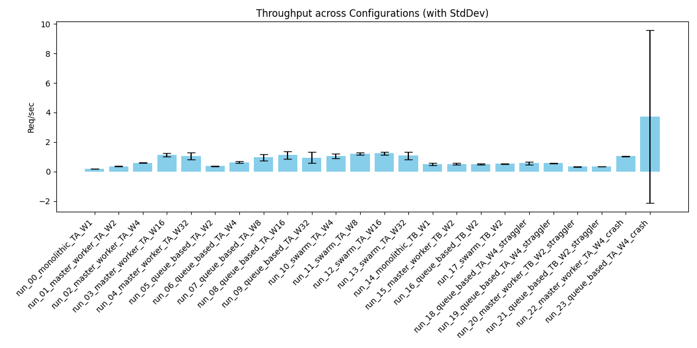
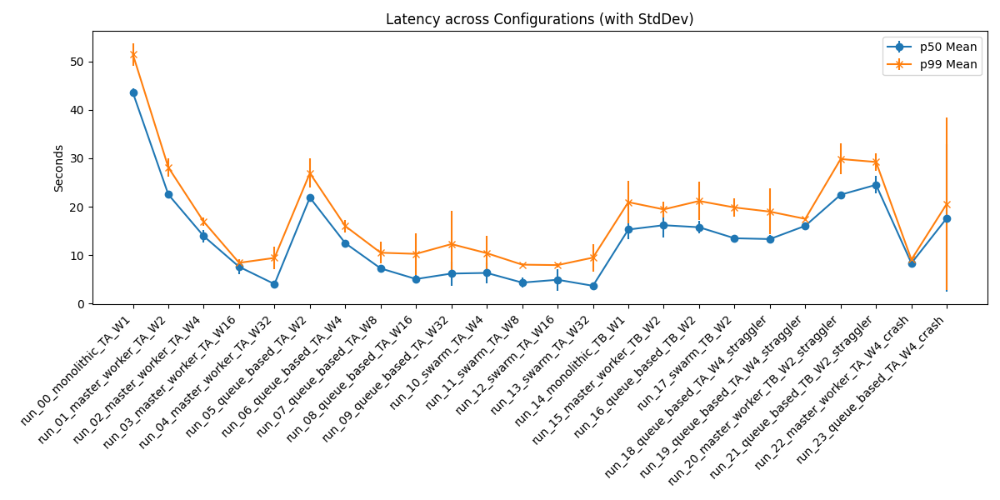
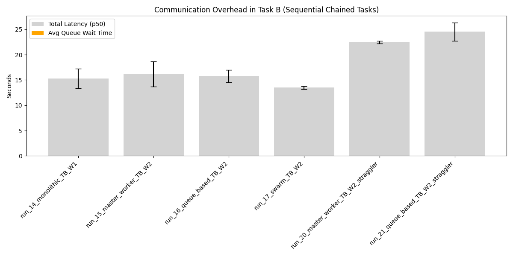

# Distributed Agent Simulation Summary Report

## 1. Overview
Generated from batch: `batch_sim_v4_20260604_002733`

## 2. Aggregate Metrics Data
| run_name                             |   throughput_req_per_sec_mean |   throughput_req_per_sec_std |   p50_latency_sec_mean |   p50_latency_sec_std |   p99_latency_sec_mean |   p99_latency_sec_std |   avg_queue_wait_sec_mean |   avg_queue_wait_sec_std |
|:-------------------------------------|------------------------------:|-----------------------------:|-----------------------:|----------------------:|-----------------------:|----------------------:|--------------------------:|-------------------------:|
| run_00_monolithic_TA_W1              |                         0.197 |                        0.007 |                 43.524 |                 0.862 |                 51.435 |                 2.281 |                     0     |                    0     |
| run_01_master_worker_TA_W2           |                         0.354 |                        0.022 |                 22.518 |                 0.183 |                 28.123 |                 1.856 |                     9.877 |                    0.273 |
| run_02_master_worker_TA_W4           |                         0.592 |                        0.015 |                 13.903 |                 1.299 |                 16.904 |                 0.822 |                     4.52  |                    0.29  |
| run_03_master_worker_TA_W16          |                         1.125 |                        0.117 |                  7.576 |                 1.533 |                  8.395 |                 0.79  |                     0.341 |                    0.006 |
| run_04_master_worker_TA_W32          |                         1.053 |                        0.219 |                  4.009 |                 0.263 |                  9.416 |                 2.246 |                     0.001 |                    0     |
| run_05_queue_based_TA_W2             |                         0.382 |                        0.019 |                 21.881 |                 0.12  |                 26.926 |                 2.998 |                     9.57  |                    0.081 |
| run_06_queue_based_TA_W4             |                         0.628 |                        0.058 |                 12.458 |                 0.279 |                 15.989 |                 1.282 |                     4.317 |                    0.268 |
| run_07_queue_based_TA_W8             |                         0.964 |                        0.205 |                  7.241 |                 0.122 |                 10.483 |                 2.244 |                     1.613 |                    0.02  |
| run_08_queue_based_TA_W16            |                         1.116 |                        0.253 |                  5.044 |                 0.868 |                 10.248 |                 4.303 |                     0.344 |                    0.005 |
| run_09_queue_based_TA_W32            |                         0.948 |                        0.384 |                  6.176 |                 2.518 |                 12.266 |                 6.911 |                     0.021 |                    0.037 |
| run_10_swarm_TA_W4                   |                         1.053 |                        0.155 |                  6.309 |                 2.211 |                 10.391 |                 3.604 |                     0     |                    0     |
| run_11_swarm_TA_W8                   |                         1.22  |                        0.073 |                  4.309 |                 1.009 |                  8.017 |                 0.356 |                     0     |                    0     |
| run_12_swarm_TA_W16                  |                         1.233 |                        0.094 |                  4.896 |                 2.212 |                  7.923 |                 0.434 |                     0     |                    0     |
| run_13_swarm_TA_W32                  |                         1.075 |                        0.261 |                  3.649 |                 0.153 |                  9.471 |                 2.825 |                     0     |                    0     |
| run_14_monolithic_TB_W1              |                         0.509 |                        0.075 |                 15.278 |                 1.952 |                 20.937 |                 4.425 |                     0     |                    0     |
| run_15_master_worker_TB_W2           |                         0.521 |                        0.052 |                 16.169 |                 2.483 |                 19.438 |                 1.619 |                     0     |                    0     |
| run_16_queue_based_TB_W2             |                         0.501 |                        0.029 |                 15.749 |                 1.255 |                 21.174 |                 3.915 |                     0     |                    0     |
| run_17_swarm_TB_W2                   |                         0.524 |                        0.026 |                 13.473 |                 0.261 |                 19.836 |                 1.818 |                     0     |                    0     |
| run_18_queue_based_TA_W4_straggler   |                         0.571 |                        0.09  |                 13.306 |                 0.833 |                 18.976 |                 4.736 |                     4.716 |                    0.344 |
| run_19_queue_based_TA_W4_straggler   |                         0.566 |                        0.011 |                 16.04  |                 0.479 |                 17.48  |                 0.19  |                     4.898 |                    0.012 |
| run_20_master_worker_TB_W2_straggler |                         0.345 |                        0.017 |                 22.47  |                 0.251 |                 29.847 |                 3.21  |                     0     |                    0     |
| run_21_queue_based_TB_W2_straggler   |                         0.349 |                        0.014 |                 24.515 |                 1.809 |                 29.235 |                 1.761 |                     0     |                    0     |
| run_22_master_worker_TA_W4_crash     |                         1.044 |                        0.026 |                  8.323 |                 0.196 |                  9.067 |                 0.18  |                     2.812 |                    0.181 |
| run_23_queue_based_TA_W4_crash       |                         3.711 |                        5.854 |                 17.639 |                15.28  |                 20.595 |                17.891 |                     4.189 |                    3.632 |

## 3. Charts
### Throughput

### Latency

### Communication Overhead (Task B)

