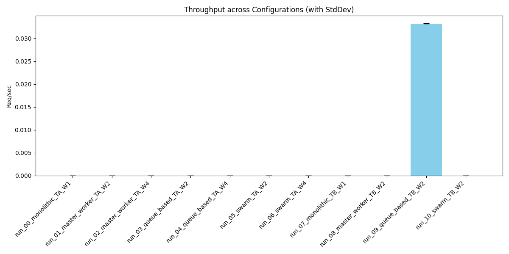
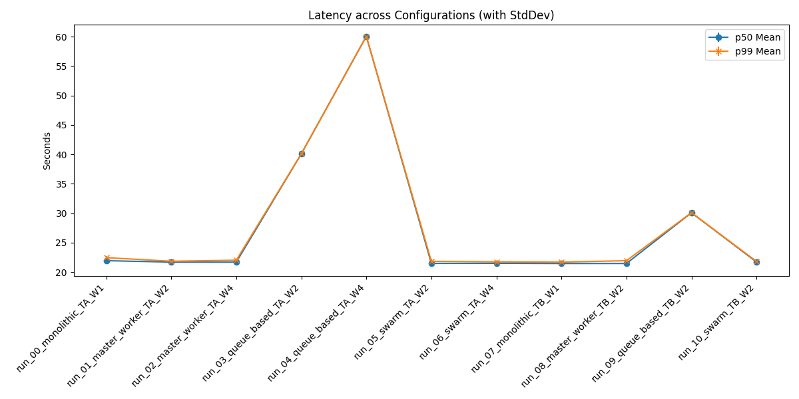
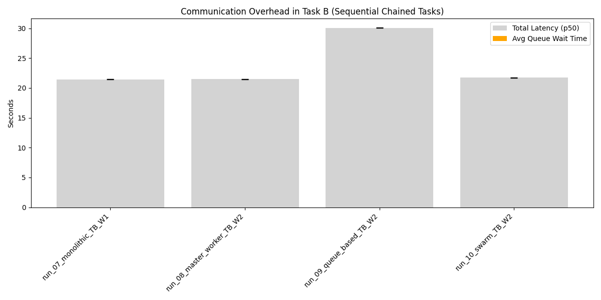

# Distributed Agent Simulation Summary Report

## 1. Overview
Generated from batch: `real_batch_20260607_143913`

## 2. Aggregate Metrics Data
| run_name                   |   throughput_req_per_sec_mean |   throughput_req_per_sec_std |   p50_latency_sec_mean |   p50_latency_sec_std |   p99_latency_sec_mean |   p99_latency_sec_std |   avg_queue_wait_sec_mean |   avg_queue_wait_sec_std |
|:---------------------------|------------------------------:|-----------------------------:|-----------------------:|----------------------:|-----------------------:|----------------------:|--------------------------:|-------------------------:|
| run_00_monolithic_TA_W1    |                         0     |                            0 |                 21.942 |                 0.189 |                 22.455 |                 0.318 |                     0     |                    0     |
| run_01_master_worker_TA_W2 |                         0     |                            0 |                 21.695 |                 0.063 |                 21.847 |                 0.022 |                     0.013 |                    0.002 |
| run_02_master_worker_TA_W4 |                         0     |                            0 |                 21.69  |                 0.015 |                 22.024 |                 0.199 |                     0.001 |                    0     |
| run_03_queue_based_TA_W2   |                         0     |                            0 |                 40.09  |                 0     |                 40.096 |                 0.002 |                     2.025 |                    0.002 |
| run_04_queue_based_TA_W4   |                         0     |                            0 |                 60.061 |                 0.009 |                 60.066 |                 0.013 |                     7.761 |                    1.169 |
| run_05_swarm_TA_W2         |                         0     |                            0 |                 21.476 |                 0.115 |                 21.827 |                 0.415 |                     0.013 |                    0.001 |
| run_06_swarm_TA_W4         |                         0     |                            0 |                 21.491 |                 0.175 |                 21.734 |                 0.026 |                     0     |                    0     |
| run_07_monolithic_TB_W1    |                         0     |                            0 |                 21.46  |                 0.058 |                 21.694 |                 0.243 |                     0     |                    0     |
| run_08_master_worker_TB_W2 |                         0     |                            0 |                 21.463 |                 0.015 |                 21.939 |                 0.207 |                     0     |                    0     |
| run_09_queue_based_TB_W2   |                         0.033 |                            0 |                 30.087 |                 0.02  |                 30.095 |                 0.02  |                     0     |                    0     |
| run_10_swarm_TB_W2         |                         0     |                            0 |                 21.719 |                 0.008 |                 21.813 |                 0.098 |                     0     |                    0     |

## 3. Charts
### Throughput

### Latency

### Communication Overhead (Task B)

