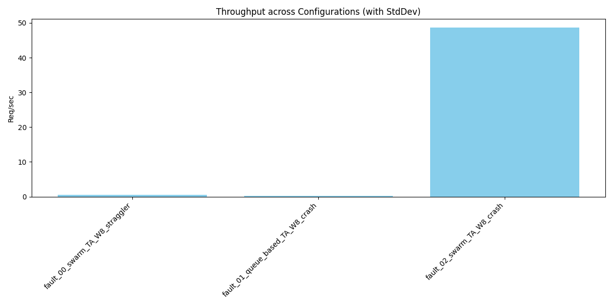
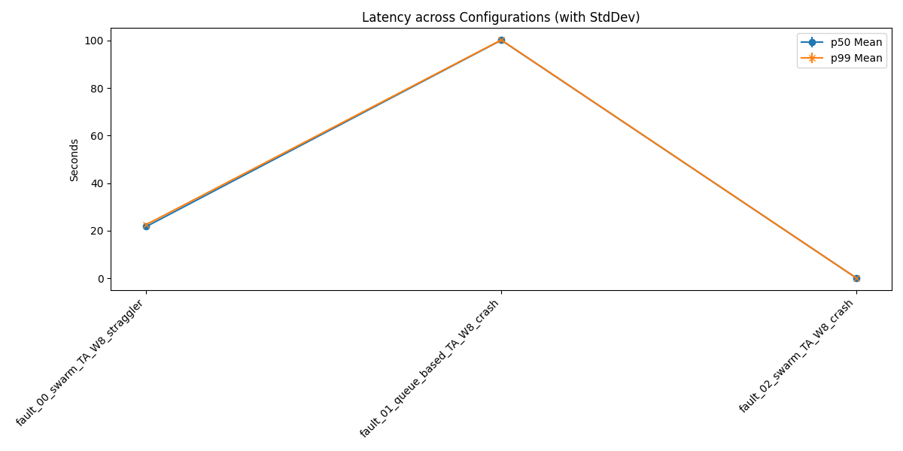

# Distributed Agent Simulation Summary Report

## 1. Overview
Generated from batch: `fault_20260607_221138`

## 2. Aggregate Metrics Data
| run_name                         |   throughput_req_per_sec_mean |   throughput_req_per_sec_std |   p50_latency_sec_mean |   p50_latency_sec_std |   p99_latency_sec_mean |   p99_latency_sec_std |   avg_queue_wait_sec_mean |   avg_queue_wait_sec_std |   avg_master_aggregation_duration_ms_mean |   avg_master_aggregation_duration_ms_std |   avg_queue_lock_wait_ms_mean |   avg_queue_lock_wait_ms_std |
|:---------------------------------|------------------------------:|-----------------------------:|-----------------------:|----------------------:|-----------------------:|----------------------:|--------------------------:|-------------------------:|------------------------------------------:|-----------------------------------------:|------------------------------:|-----------------------------:|
| fault_00_swarm_TA_W8_straggler   |                         0.456 |                          nan |                 21.721 |                   nan |                 22.573 |                   nan |                     0.013 |                      nan |                                         0 |                                      nan |                         0     |                          nan |
| fault_01_queue_based_TA_W8_crash |                         0.194 |                          nan |                100.171 |                   nan |                100.256 |                   nan |                     9.97  |                      nan |                                         0 |                                      nan |                        18.957 |                          nan |
| fault_02_swarm_TA_W8_crash       |                        48.671 |                          nan |                  0.087 |                   nan |                  0.097 |                   nan |                     0.009 |                      nan |                                         0 |                                      nan |                         0     |                          nan |

## 3. Charts
### Throughput

### Latency

