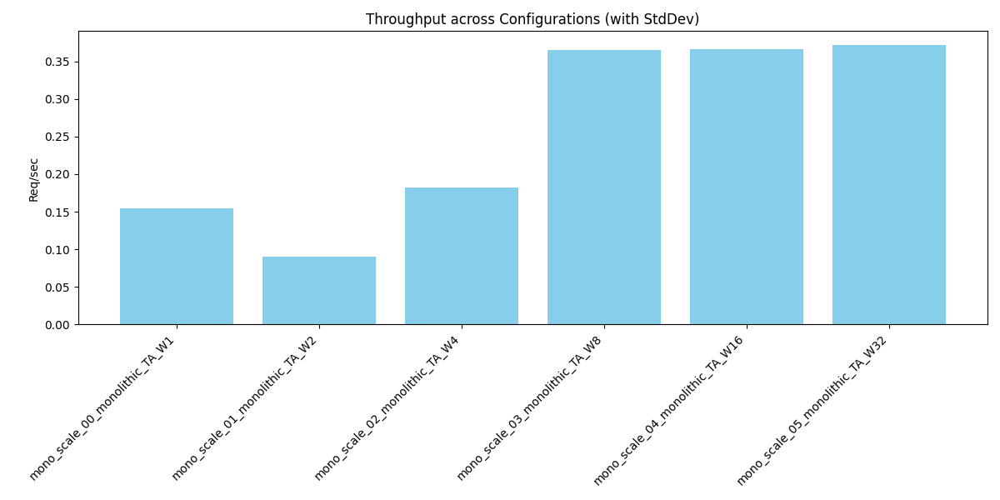
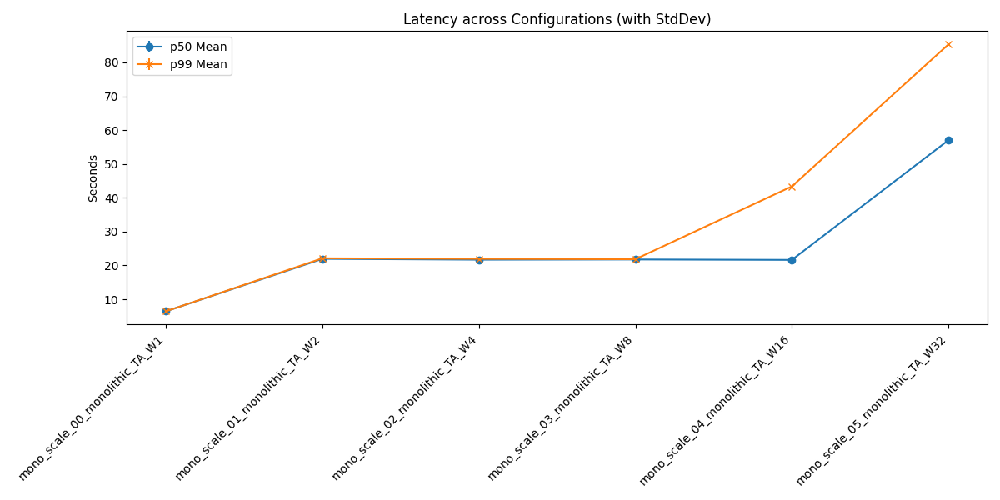

# Distributed Agent Simulation Summary Report

## 1. Overview
Generated from batch: `mono_scale_20260607_220449`

## 2. Aggregate Metrics Data
| run_name                        |   throughput_req_per_sec_mean |   throughput_req_per_sec_std |   p50_latency_sec_mean |   p50_latency_sec_std |   p99_latency_sec_mean |   p99_latency_sec_std |   avg_queue_wait_sec_mean |   avg_queue_wait_sec_std |   avg_master_aggregation_duration_ms_mean |   avg_master_aggregation_duration_ms_std |   avg_queue_lock_wait_ms_mean |   avg_queue_lock_wait_ms_std |
|:--------------------------------|------------------------------:|-----------------------------:|-----------------------:|----------------------:|-----------------------:|----------------------:|--------------------------:|-------------------------:|------------------------------------------:|-----------------------------------------:|------------------------------:|-----------------------------:|
| mono_scale_00_monolithic_TA_W1  |                         0.155 |                          nan |                  6.453 |                   nan |                  6.453 |                   nan |                         0 |                      nan |                                         0 |                                      nan |                             0 |                          nan |
| mono_scale_01_monolithic_TA_W2  |                         0.091 |                          nan |                 21.96  |                   nan |                 22.123 |                   nan |                         0 |                      nan |                                         0 |                                      nan |                             0 |                          nan |
| mono_scale_02_monolithic_TA_W4  |                         0.182 |                          nan |                 21.715 |                   nan |                 21.956 |                   nan |                         0 |                      nan |                                         0 |                                      nan |                             0 |                          nan |
| mono_scale_03_monolithic_TA_W8  |                         0.365 |                          nan |                 21.772 |                   nan |                 21.847 |                   nan |                         0 |                      nan |                                         0 |                                      nan |                             0 |                          nan |
| mono_scale_04_monolithic_TA_W16 |                         0.367 |                          nan |                 21.646 |                   nan |                 43.367 |                   nan |                         0 |                      nan |                                         0 |                                      nan |                             0 |                          nan |
| mono_scale_05_monolithic_TA_W32 |                         0.372 |                          nan |                 57.027 |                   nan |                 85.336 |                   nan |                         0 |                      nan |                                         0 |                                      nan |                             0 |                          nan |

## 3. Charts
### Throughput

### Latency

