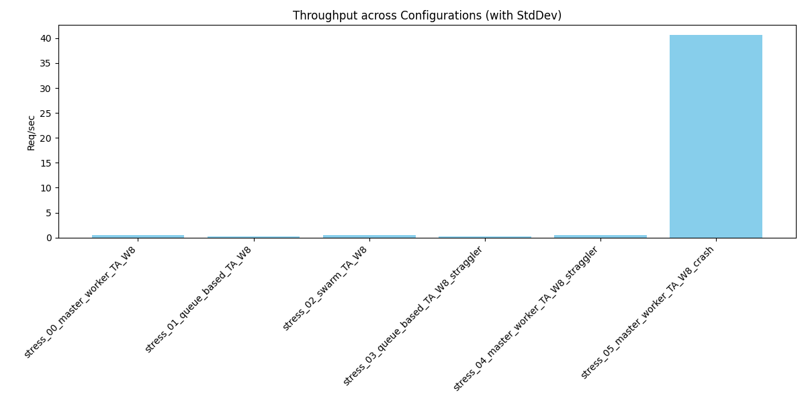
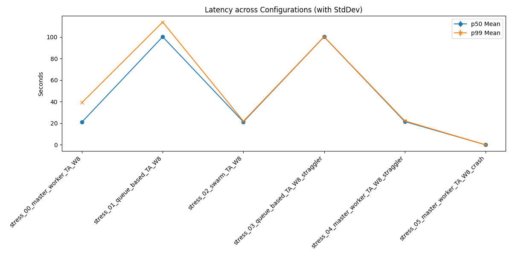

# Distributed Agent Simulation Summary Report

## 1. Overview
Generated from batch: `stress_20260607_191924`

## 2. Aggregate Metrics Data
| run_name                                |   throughput_req_per_sec_mean |   throughput_req_per_sec_std |   p50_latency_sec_mean |   p50_latency_sec_std |   p99_latency_sec_mean |   p99_latency_sec_std |   avg_queue_wait_sec_mean |   avg_queue_wait_sec_std |   avg_master_aggregation_duration_ms_mean |   avg_master_aggregation_duration_ms_std |   avg_queue_lock_wait_ms_mean |   avg_queue_lock_wait_ms_std |
|:----------------------------------------|------------------------------:|-----------------------------:|-----------------------:|----------------------:|-----------------------:|----------------------:|--------------------------:|-------------------------:|------------------------------------------:|-----------------------------------------:|------------------------------:|-----------------------------:|
| stress_00_master_worker_TA_W8           |                         0.438 |                          nan |                 21.136 |                   nan |                 39.155 |                   nan |                     0.017 |                      nan |                                         0 |                                      nan |                         0     |                          nan |
| stress_01_queue_based_TA_W8             |                         0.19  |                          nan |                100.166 |                   nan |                113.811 |                   nan |                    10.323 |                      nan |                                         0 |                                      nan |                        19.955 |                          nan |
| stress_02_swarm_TA_W8                   |                         0.469 |                          nan |                 21.274 |                   nan |                 21.865 |                   nan |                     0.015 |                      nan |                                         0 |                                      nan |                         0     |                          nan |
| stress_03_queue_based_TA_W8_straggler   |                         0.2   |                          nan |                100.169 |                   nan |                100.196 |                   nan |                    10.415 |                      nan |                                         0 |                                      nan |                        19.81  |                          nan |
| stress_04_master_worker_TA_W8_straggler |                         0.462 |                          nan |                 21.565 |                   nan |                 22.183 |                   nan |                     0.016 |                      nan |                                         0 |                                      nan |                         0     |                          nan |
| stress_05_master_worker_TA_W8_crash     |                        40.59  |                          nan |                  0.001 |                   nan |                  0.001 |                   nan |                     0     |                      nan |                                         0 |                                      nan |                         0     |                          nan |

## 3. Charts
### Throughput

### Latency

