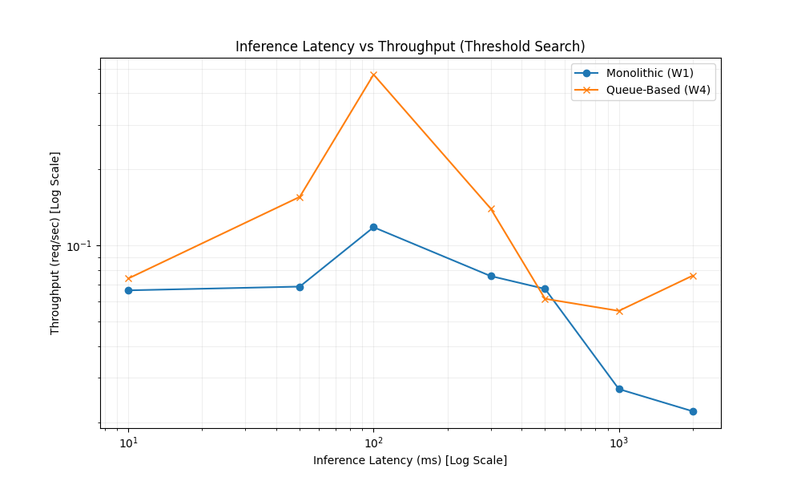

# Sweep Latency Experiment Report

## 1. Overview
Generated from batch: `sweep_20260607_170936`

## 2. Chart

## 3. Data
| architecture   |   latency_ms |   throughput_req_per_sec |   p50_latency_sec |
|:---------------|-------------:|-------------------------:|------------------:|
| monolithic     |           10 |                    0.067 |            15.018 |
| monolithic     |           50 |                    0.069 |            14.514 |
| monolithic     |          100 |                    0.118 |             8.454 |
| monolithic     |          300 |                    0.076 |            13.184 |
| monolithic     |          500 |                    0.067 |            14.818 |
| monolithic     |         1000 |                    0.027 |            36.879 |
| monolithic     |         2000 |                    0.022 |            45.135 |
| queue_based    |           10 |                    0.074 |            13.476 |
| queue_based    |           50 |                    0.156 |             6.41  |
| queue_based    |          100 |                    0.475 |             2.104 |
| queue_based    |          300 |                    0.14  |             7.126 |
| queue_based    |          500 |                    0.062 |            16.211 |
| queue_based    |         1000 |                    0.055 |            18.099 |
| queue_based    |         2000 |                    0.076 |            13.132 |
