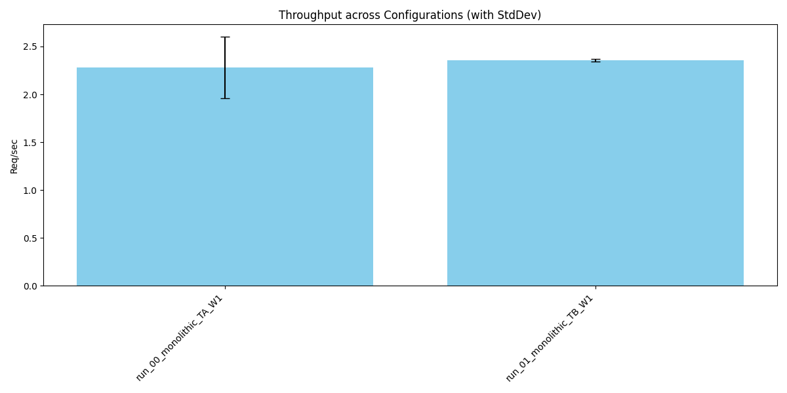
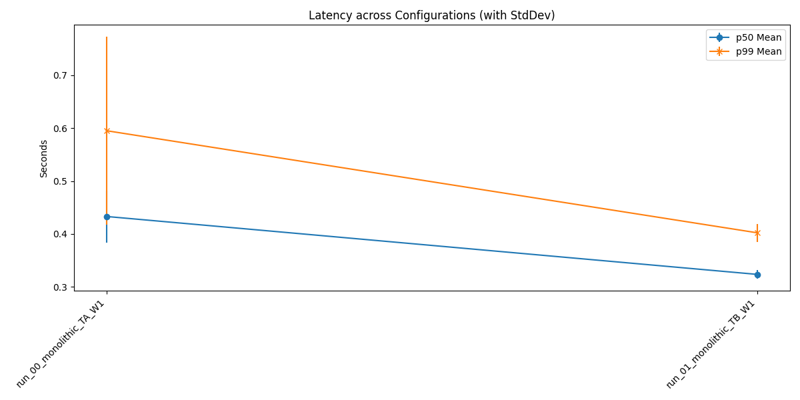
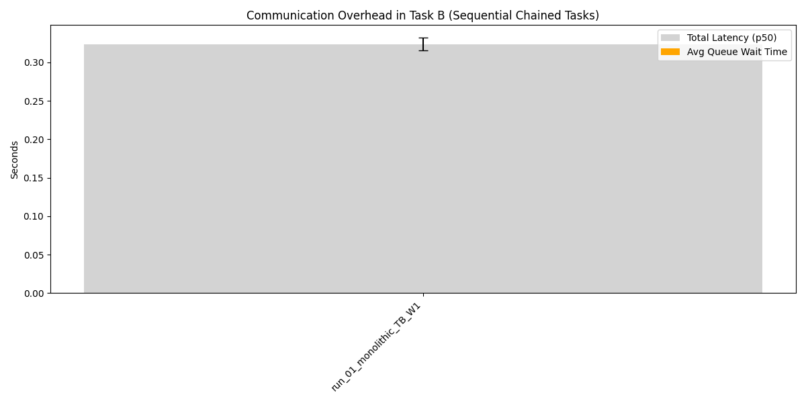

# Distributed Agent Simulation Summary Report

## 1. Overview
Generated from batch: `real_batch_20260607_141520`

## 2. Aggregate Metrics Data
| run_name                |   throughput_req_per_sec_mean |   throughput_req_per_sec_std |   p50_latency_sec_mean |   p50_latency_sec_std |   p99_latency_sec_mean |   p99_latency_sec_std |   avg_queue_wait_sec_mean |   avg_queue_wait_sec_std |
|:------------------------|------------------------------:|-----------------------------:|-----------------------:|----------------------:|-----------------------:|----------------------:|--------------------------:|-------------------------:|
| run_00_monolithic_TA_W1 |                         2.281 |                        0.319 |                  0.433 |                 0.049 |                  0.595 |                 0.177 |                         0 |                        0 |
| run_01_monolithic_TB_W1 |                         2.354 |                        0.014 |                  0.324 |                 0.008 |                  0.402 |                 0.017 |                         0 |                        0 |

## 3. Charts
### Throughput

### Latency

### Communication Overhead (Task B)

