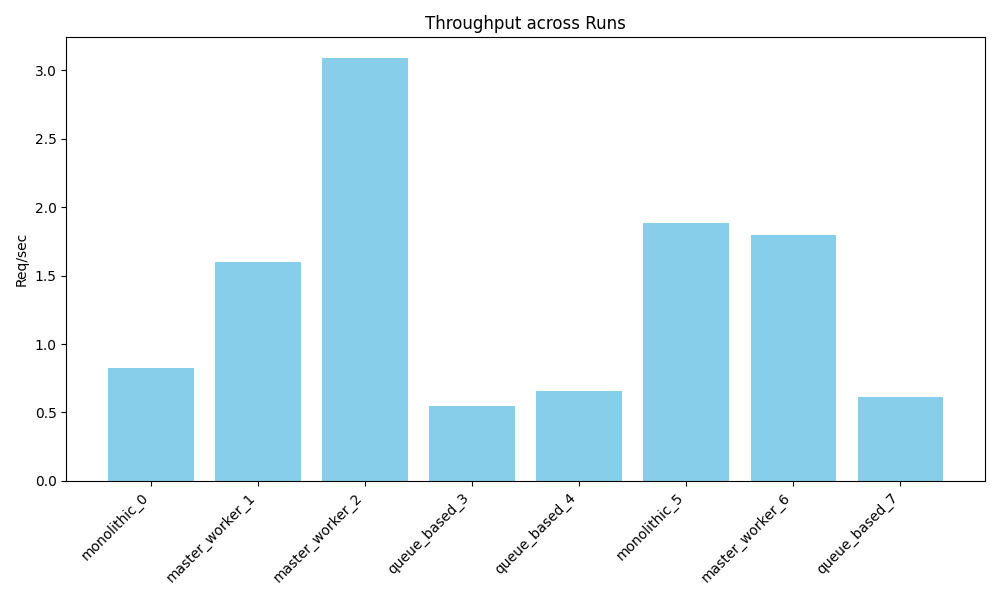
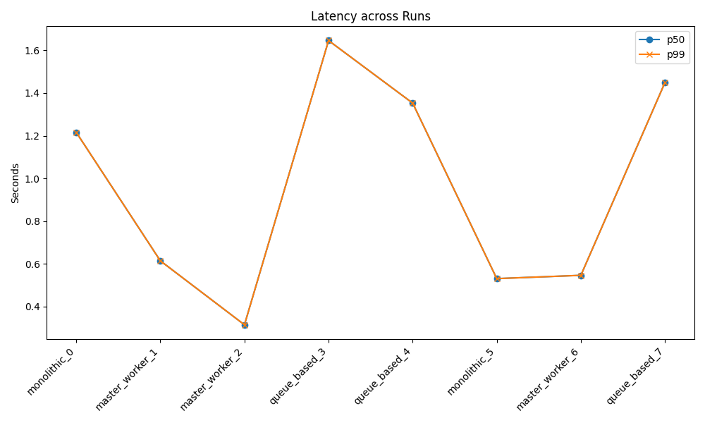

# Distributed Agent Simulation Summary Report

## 1. Overview
Generated from batch: `batch_20260602_142012`

## 2. Metrics Data
| architecture   |   total_requests |   completed_requests |   total_duration_sec |   throughput_req_per_sec |   p50_latency_sec |   p95_latency_sec |   p99_latency_sec |   avg_queue_wait_sec |   retries |   timeouts |   crashes | run_name        |
|:---------------|-----------------:|---------------------:|---------------------:|-------------------------:|------------------:|------------------:|------------------:|---------------------:|----------:|-----------:|----------:|:----------------|
| monolithic     |                1 |                    1 |             1.21619  |                 0.822238 |          1.21619  |          1.21619  |          1.21619  |             0        |         0 |          0 |         0 | monolithic_0    |
| master_worker  |                1 |                    1 |             0.624564 |                 1.60112  |          0.614564 |          0.614564 |          0.614564 |             0.271526 |         0 |          0 |         0 | master_worker_1 |
| master_worker  |                1 |                    1 |             0.323998 |                 3.08644  |          0.314999 |          0.314999 |          0.314999 |             0.117878 |         0 |          0 |         0 | master_worker_2 |
| queue_based    |                1 |                    1 |             1.82183  |                 0.5489   |          1.64592  |          1.64592  |          1.64592  |             0.303801 |         0 |          0 |         0 | queue_based_3   |
| queue_based    |                1 |                    1 |             1.52483  |                 0.655811 |          1.35285  |          1.35285  |          1.35285  |             0.134893 |         0 |          0 |         0 | queue_based_4   |
| monolithic     |                1 |                    1 |             0.53116  |                 1.88267  |          0.53116  |          0.53116  |          0.53116  |             0        |         0 |          0 |         0 | monolithic_5    |
| master_worker  |                1 |                    1 |             0.556691 |                 1.79633  |          0.546691 |          0.546691 |          0.546691 |             0.0002   |         0 |          0 |         0 | master_worker_6 |
| queue_based    |                1 |                    1 |             1.63254  |                 0.612542 |          1.44948  |          1.44948  |          1.44948  |             0        |         0 |          0 |         0 | queue_based_7   |

## 3. Charts
### Throughput

### Latency

