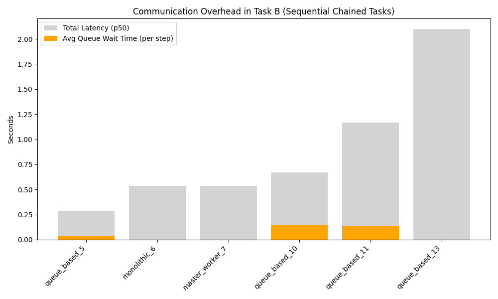

# Distributed Agent Simulation Summary Report

## 1. Overview
Generated from batch: `batch_20260602_165836`

## 2. Metrics Data
| architecture   |   total_requests |   completed_requests |   total_duration_sec |   throughput_req_per_sec |   p50_latency_sec |   p95_latency_sec |   p99_latency_sec |   avg_queue_wait_sec |   retries |   timeouts |   crashes | run_name         |
|:---------------|-----------------:|---------------------:|---------------------:|-------------------------:|------------------:|------------------:|------------------:|---------------------:|----------:|-----------:|----------:|:-----------------|
| monolithic     |                1 |                    1 |             0.934874 |                1.06966   |          0.934874 |          0.934874 |          0.934874 |           0          |         0 |          0 |         0 | monolithic_0     |
| master_worker  |                1 |                    1 |             0.600406 |                1.66554   |          0.584405 |          0.584405 |          0.584405 |           0.258925   |         0 |          0 |         0 | master_worker_1  |
| master_worker  |                1 |                    1 |             0.318507 |                3.13965   |          0.306506 |          0.306506 |          0.306506 |           0.114787   |         0 |          0 |         0 | master_worker_2  |
| queue_based    |                1 |                    1 |             0.672295 |                1.48744   |          0.659296 |          0.659296 |          0.659296 |           0.235919   |         0 |          0 |         0 | queue_based_3    |
| queue_based    |                1 |                    1 |             0.431841 |                2.31567   |          0.418249 |          0.418249 |          0.418249 |           0.110569   |         0 |          0 |         0 | queue_based_4    |
| queue_based    |                1 |                    1 |             0.305972 |                3.26827   |          0.289972 |          0.289972 |          0.289972 |           0.0417741  |         0 |          0 |         0 | queue_based_5    |
| monolithic     |                1 |                    1 |             0.536081 |                1.86539   |          0.536081 |          0.536081 |          0.536081 |           0          |         0 |          0 |         0 | monolithic_6     |
| master_worker  |                1 |                    1 |             0.547172 |                1.82758   |          0.534673 |          0.534673 |          0.534673 |           0.0001994  |         0 |          0 |         0 | master_worker_7  |
| queue_based    |                1 |                    1 |             0.685034 |                1.45978   |          0.673034 |          0.673034 |          0.673034 |           0          |         0 |          0 |         0 | queue_based_8    |
| queue_based    |                1 |                    1 |             0.588731 |                1.69857   |          0.57515  |          0.57515  |          0.57515  |           0.140225   |         0 |          0 |         0 | queue_based_9    |
| queue_based    |                1 |                    1 |             0.68275  |                1.46466   |          0.669141 |          0.669141 |          0.669141 |           0.150164   |         0 |          0 |         0 | queue_based_10   |
| queue_based    |                1 |                    1 |             1.17968  |                0.847686  |          1.16568  |          1.16568  |          1.16568  |           0.137004   |         0 |          0 |         0 | queue_based_11   |
| master_worker  |                1 |                    1 |             2.01256  |                0.49688   |          2.00156  |          2.00156  |          2.00156  |           0.0003998  |         0 |          0 |         0 | master_worker_12 |
| queue_based    |                1 |                    1 |             2.11022  |                0.473884  |          2.09722  |          2.09722  |          2.09722  |           0          |         0 |          0 |         0 | queue_based_13   |
| swarm          |                1 |                    1 |             0.084368 |               11.8528    |          0.074807 |          0.074807 |          0.074807 |           0.00025    |         0 |          0 |         0 | swarm_14         |
| swarm          |                1 |                    1 |             0.47246  |                2.11658   |          0.462846 |          0.462846 |          0.462846 |           0          |         0 |          0 |         0 | swarm_15         |
| swarm          |                1 |                    1 |             0.08815  |               11.3443    |          0.07915  |          0.07915  |          0.07915  |           0.00020005 |         0 |          0 |         0 | swarm_16         |
| master_worker  |                1 |                    1 |             0.266896 |                3.74678   |          0.254319 |          0.254319 |          0.254319 |           0.0817649  |         0 |          0 |         5 | master_worker_17 |
| queue_based    |                1 |                    1 |            34.3095   |                0.0291464 |         34.2955   |         34.2955   |         34.2955   |           0.0009506  |         0 |          0 |        17 | queue_based_18   |

## 3. Charts
### Throughput

### Latency

### Communication Overhead (Task B)

